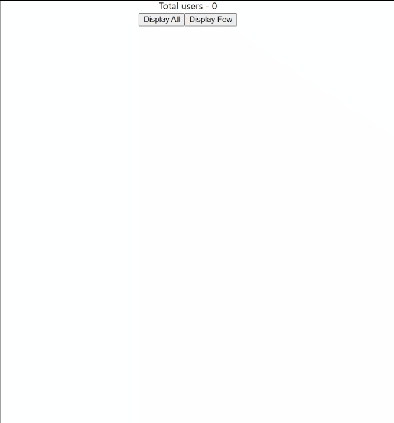

# full-stack-project

Contains 2 folders   

1. react-webpack-reduxtk-axios   UI created using ReactJS library   Uses Webpack for build   redux , react-redux, reduxjs/toolkit libraries are used for state management   axios library for making HTTP calls   Configuring Webpack and babel https://medium.com/age-of-awareness/setup-react-with-webpack-and-babel-5114a14a47e9   Setting up the store     1. Create store object using configureStore of RTK   2. Create action object and reducer using createSlice of RTK   3. Export store and update action in index.js   4. Call dispatch function of react-redux with JSON payload size in fetchUsers function   5. Use useSelector hook to get redux stores data . It works as a subscriber   6. When dispatch function is called it updates the store and DisplayCount component is rerendered with new total count value    How does it work? When you click 'Display All' or 'Display Few' button axios makes a REST API call and receives a JSON payload. On receiving the payload the handler in then is called where it updates users list and calls dispatch function which will update the store . The update in store will trigger useSelector hook in DisplayCount and it will be rerendered to display the new count of users list     

2. express-rest-api   REST API created using express.js  
endpoints -   http://localhost:3003/all/ returns a 1.35 MB JSON payload   http://localhost:3003/few/ returns a 1KB JSON payload   Dummy JSON payload generator https://json-generator.com/#   

